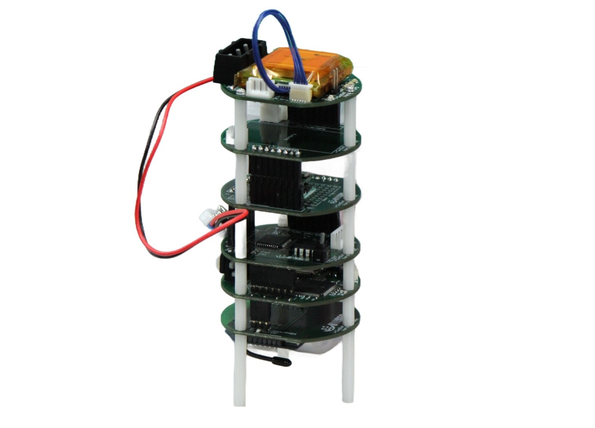

# CanSat

### Overview

[7th CanSat Leader Training Program - CLTP 7](https://cltp.info/cltp7.html)

"CanSat" is a simulated satellite that has a size of a 350 ml juice can. This can is equipped with a battery, microcomputer, communication device, sensor, and GPS, and is launched using a small rocket. It performs data acquisition and communication tasks while falling to the ground.
